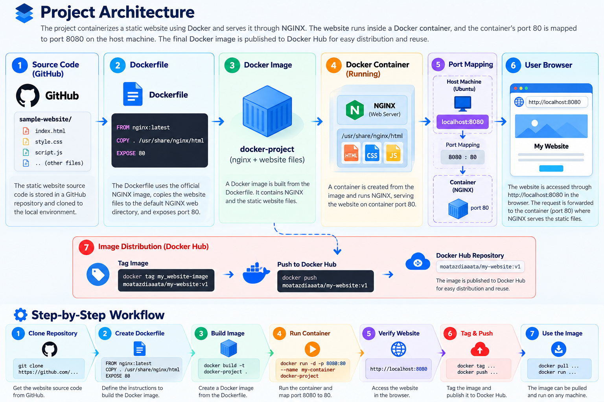

# 🐳 Dockerized Website Deployment with NGINX


## 📌 Project Overview

This project demonstrates the fundamental workflow of containerizing a static HTML/CSS/JavaScript website using **Docker and NGINX**.

The website source code is obtained from GitHub, packaged into a Docker image using a Dockerfile, executed inside a Docker container, verified locally through a web browser, and finally tagged and published to Docker Hub for distribution and reuse.

---

# 🏗️ Project Architecture

The architecture explains how the website moves from source code to a running NGINX container and how the final Docker image is distributed through Docker Hub.



### Architecture Components

| Component | Role |
|---|---|
| **GitHub** | Stores the website source code and project files |
| **Dockerfile** | Defines how the Docker image is built |
| **Docker Image** | Contains NGINX and the website files |
| **Docker Container** | Runs the Docker image as an isolated application |
| **NGINX** | Serves the static HTML/CSS/JavaScript files |
| **Port Mapping** | Maps host port `8080` to container port `80` |
| **Browser** | Sends HTTP requests to `localhost:8080` |
| **Docker Hub** | Stores and distributes the published Docker image |

### Request Flow

```text
Browser
   │
   │ HTTP Request
   ▼
localhost:8080
   │
   │ Docker Port Mapping
   ▼
Container Port 80
   │
   ▼
NGINX
   │
   ▼
/usr/share/nginx/html
   │
   ▼
HTML / CSS / JavaScript
   │
   ▼
Browser
```

The important port mapping is:

```text
Host: 8080  ─────────────►  Container: 80
```

---

# 🔄 Complete Project Workflow

```text
GitHub Source Code
        ↓
Clone Repository
        ↓
Create Dockerfile
        ↓
Build Docker Image
        ↓
Run Docker Container
        ↓
Verify Website
        ↓
Commit Container
        ↓
Tag Docker Image
        ↓
Push to Docker Hub
```

---

# 1️⃣ Clone the Project

The project source code was cloned from the provided GitHub repository into the Ubuntu environment.

### Commands

```bash
git clone https://github.com/MenaMagdyHalem/Course-Docker.git
cd Course-Docker/sample-website
```

### 📸 Screenshot — Repository Cloning


---

# 2️⃣ Create the Dockerfile

A Dockerfile was created inside the `sample-website` directory.

```dockerfile
FROM nginx:latest

COPY . /usr/share/nginx/html

EXPOSE 80
```

### Why NGINX?

NGINX is used as the web server because the project contains static HTML, CSS, and JavaScript files.

### Dockerfile Explanation

- `FROM nginx:latest` — uses the official NGINX image as the base image.
- `COPY . /usr/share/nginx/html` — copies the website files into NGINX's default web root.
- `EXPOSE 80` — documents that NGINX listens on port `80` inside the container.

### 📸 Screenshot — Dockerfile


---

# 3️⃣ Build the Docker Image

The Docker image was built from the Dockerfile.

```bash
docker build -t docker-project .
```

The resulting image is:

```text
docker-project:latest
```

### 📸 Screenshot — Docker Image Build


---

# 4️⃣ Run the Docker Container

A container was created from the Docker image.

```bash
docker run -it -d -p 8080:80 --name my-container docker-project
```

The running container was verified using:

```bash
docker ps
```

### Port Mapping

```text
Host Port 8080  →  Container Port 80
```

Docker forwards requests received on port `8080` of the host to port `80` inside the container.

### 📸 Screenshot — Running the Container


---

# 5️⃣ Verify the Website

The website was accessed through:

```text
http://localhost:8080
```

The browser sends the request to the host machine, Docker forwards it to container port `80`, and NGINX serves the website files.

### 📸 Screenshot — Website Verification


---

# 6️⃣ Create an Image from the Container

The running container was committed into a new Docker image.

```bash
docker commit my-container my_website-image
```

This captures the current state of the container as a new image.

> **Note:** For reproducible production builds, building from a Dockerfile is generally preferred. `docker commit` is included here to demonstrate capturing a container's current state as an image.

### 📸 Screenshot — Docker Commit


---

# 7️⃣ Tag the Docker Image

The image was tagged using the Docker Hub repository name.

```bash
docker tag my_website-image moatazdiaaata/my-website:v1
```

Final image reference:

```text
moatazdiaaata/my-website:v1
```

### 📸 Screenshot — Image Tagging


---

# 8️⃣ Push the Image to Docker Hub

The tagged image was published to Docker Hub.

```bash
docker push moatazdiaaata/my-website:v1
```

### 📸 Screenshot — Docker Hub Push


---

# 9️⃣ Using the Published Docker Image

The published image can be reused on another Docker-enabled environment.

### Pull

```bash
docker pull moatazdiaaata/my-website:v1
```

### Run

```bash
docker run -d -p 8080:80 --name my-website-container moatazdiaaata/my-website:v1
```

### Access

```text
http://localhost:8080
```

---

# 🧩 Why This Architecture?

The architecture separates the project into simple and reusable components:

1. **Source Code** — the website files are maintained separately from the runtime environment.
2. **Dockerfile** — defines how the runtime environment and image are built.
3. **Docker Image** — packages NGINX and the website files into a portable artifact.
4. **Docker Container** — provides an isolated runtime environment.
5. **NGINX** — serves the static website to the browser.
6. **Docker Hub** — stores and distributes the Docker image.

This approach makes the application easier to reproduce, distribute, and run on another Docker-enabled environment.

---

# 🛠️ Technologies Used

| Technology | Purpose |
|---|---|
| **Docker** | Containerization and image management |
| **Dockerfile** | Defines image build instructions |
| **NGINX** | Serves the static website |
| **Ubuntu** | Development environment |
| **Git** | Version control |
| **GitHub** | Source code repository |
| **Docker Hub** | Docker image registry |
| **HTML / CSS / JavaScript** | Website technologies |

---

# 📊 Project Results

- ✅ Static website successfully containerized.
- ✅ NGINX successfully used as the web server.
- ✅ Docker image successfully built.
- ✅ Container successfully created and run.
- ✅ Host-to-container port mapping configured.
- ✅ Website successfully verified in the browser.
- ✅ Container state captured as a Docker image.
- ✅ Image tagged for Docker Hub.
- ✅ Image successfully published to Docker Hub.

---

# 🔗 Project Resources

### GitHub Repository

https://github.com/MoatazDiaaAta/Course-Docker

### Docker Hub Repository

https://hub.docker.com/r/moatazdiaaata/my-website

---

# 🎯 Skills Demonstrated

- Docker image and container management
- Dockerfile creation
- NGINX containerization
- Linux / Ubuntu command-line usage
- Docker port mapping
- Docker image tagging
- Docker Hub publishing
- Git and GitHub workflow
- Static website deployment

---

# 👨‍💻 Author

**Moataz Diaa**

Electronics & Communications Engineering

Interested in DevOps & Cloud Engineering
